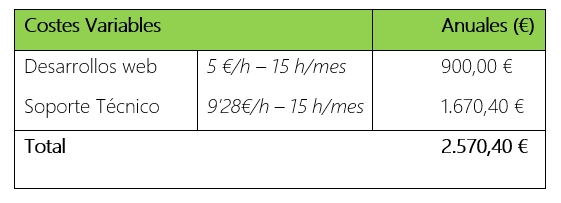

# Anteproxecto fin de ciclo

- [Anteproxecto fin de ciclo](#anteproxecto-fin-de-ciclo)
  - [1- Descrición do proxecto](#1--descrición-do-proxecto)
  - [2- Empresa](#2--empresa)
    - [2.1- Idea de negocio](#21--idea-de-negocio)
    - [2.2- Xustificación da idea](#22--xustificación-da-idea)
    - [2.3- Segmento de clientes](#23--segmento-de-clientes)
    - [2.4- Axudas e financiación](#24--axudas-e-financiación)
    - [2.5- Modelo de negocio](#25--modelo-de-negocio)
      - [2.5.1- Viabilidade](#251--viabilidade)
        - [2.5.1.1- Viabilidade técnica](#2511--viabilidade-técnica)
        - [2.5.1.2- Viabilidade económica](#2512--viabilidade-económica)
      - [2.5.1.3- Conclusión](#2513--conclusión)
    - [2.6- Competencia](#26--competencia)
    - [2.7- Promoción](#27--promoción)
    - [2.8- Proposta de valor](#28--proposta-de-valor)
    - [2.9- Forma xurídica](#29--forma-xurídica)
    - [2.10- Prevención de riesgos laborales](#210--prevención-de-riesgos-laborales)
  - [3- Requirimentos técnicos](#3--requirimentos-técnicos)
  - [4- Planificación](#4--planificación)

> _EXPLICACIÓN_: Este documento será a páxina de explicación de en que consiste o teu proxecto. Coida a súa redacción con todo ou teu mimo. Elimina posteriormente todas as lineas "EXPLICACIÓN" cando creas finalizada a súa redacción.
> Podes acompañar á redacción deste ficheiro con imaxes, pero non abuses deles.
> Explica da mellor forma posible de en que consiste o proxecto é que ferramentas e linguaxes de programación empregarás.

## 1- Descrición do proxecto

La aplicación está destinada a la gestión de mantenimientos de equipos, dirigida principalmente a empresas especializadas en este ámbito. El propósito principal de la aplicación es proporcionar una plataforma centralizada que simplifique la gestión de clientes, dispositivos y mantenimientos.

Con esta aplicación, las empresas podrán registrar nuevos clientes y asociar dispositivos a cada uno de ellos, lo que facilitará la creación de un historial detallado de los mantenimientos realizados en cada equipo. Además, la plataforma permitirá asignar técnicos a las solicitudes de servicio y llevar un seguimiento exhaustivo de las intervenciones realizadas.

El objetivo principal de esta aplicación es optimizar y agilizar el proceso de gestión de mantenimientos, permitiendo a las empresas ofrecer un servicio más eficiente y de mayor calidad a sus clientes. Además, se considera que esta solución tiene potencial para convertirse en una herramienta comercializable ya que muchas empresas requieren de herramientas eficientes para gestionar sus operaciones de mantenimiento.

## 2- Empresa

> _EXPLICACIÓN_: Neste apartado desenvolveredes todo o referente os módulos de Empresa e iniciativa emprendedora e de FOL.

### 2.1- Idea de negocio

El producto central de este proyecto es una aplicación de gestión de mantenimientos de equipos. Su principal valor añadido radica en proporcionar a las empresas una plataforma centralizada y eficiente para gestionar clientes, dispositivos y mantenimientos.

La utilidad de esta aplicación es facilitar la administración de los procesos de mantenimiento y reparación de equipos, permitiendo a las empresas llevar un registro detallado de los clientes, los dispositivos asociados a cada uno y los mantenimientos realizados en cada equipo. Esto les ayudará a mejorar la organización interna, optimizar la asignación de recursos y ofrecer un servicio más eficiente y de mayor calidad a sus clientes.

Además del producto central, se podrían ofrecer productos aumentados, como servicios de análisis de datos para identificar tendencias en los mantenimientos realizados, herramientas de programación de intervenciones automatizadas o servicios de asesoramiento técnico para la optimización de procesos de mantenimiento. Estos productos aumentados podrían ofrecer un valor adicional y ampliar las posibilidades de negocio para las empresas que utilicen la aplicación.

### 2.2- Xustificación da idea

La idea de desarrollar una aplicación para la gestión de mantenimientos de equipos surge de la necesidad identificada en muchas empresas de servicios de mantenimiento y reparación de dispositivos de contar con una herramienta eficiente para organizar y gestionar sus actividades. Esta necesidad se deriva de la complejidad inherente a la gestión de múltiples clientes, dispositivos y tareas de mantenimiento, así como de la falta de soluciones integrales disponibles en el mercado que satisfagan estas necesidades de manera adecuada.

Actualmente, existen algunas aplicaciones y productos en el mercado que intentan abordar esta problemática, pero muchas de ellas son soluciones fragmentadas o poco adaptadas a las necesidades específicas de este sector. En general, estas herramientas suelen carecer de funcionalidades completas para la gestión de clientes, dispositivos y mantenimientos, lo que dificulta su uso y limita su eficacia.

Por lo tanto, se puede decir que se trata de un segmento de mercado desabastecido o insuficientemente atendido, donde hay una clara oportunidad para desarrollar una solución integral y eficiente que cubra todas las necesidades de gestión de mantenimientos de equipos.

#### Análisis DAFO

##### Debilidades:
- Falta de experiencia en el desarrollo de aplicaciones de gestión.
- Necesidad de inversión inicial para el desarrollo y lanzamiento del producto.
- Posible resistencia al cambio por parte de los usuarios acostumbrados a otros métodos de gestión.
- Competencia potencial de empresas establecidas en el mercado de software de gestión.

##### Amenazas:
- Rápida evolución tecnológica que puede hacer obsoleta la aplicación en poco tiempo.
- Posibles problemas de seguridad y privacidad de los datos de los clientes.
- Posibilidad de cambios en la regulación que afecten al mercado o a las operaciones del negocio.

##### Fortalezas:
- Solución integral que cubre todas las necesidades de gestión de mantenimientos de equipos.
- Potencial para capturar un segmento de mercado desatendido o insuficientemente atendido.
- Flexibilidad para adaptarse a las necesidades específicas de cada cliente.
- Posibilidad de ofrecer servicios de valor añadido, como soporte técnico o consultoría.

##### Oportunidades:
- Demanda creciente de soluciones de gestión eficientes en el sector de servicios de mantenimiento y reparación.
- Posibilidad de expandir el negocio a otros sectores o mercados relacionados con la gestión de activos.
- Potencial para establecer alianzas estratégicas con fabricantes de equipos o empresas de servicios complementarios.

### 2.3- Segmento de clientes

#### Mercado Objetivo:
- El negocio estará dirigido a empresas dedicadas al mantenimiento y reparación de equipos, como empresas de servicios de informática, empresas de reparación de electrodomésticos, empresas de mantenimiento industrial, entre otras.
- También se puede considerar como potenciales clientes a departamentos de mantenimiento de grandes empresas o instituciones que gestionan sus propios equipos internamente.

#### Características del Segmento:
- Las empresas del segmento suelen tener una amplia variedad de equipos y dispositivos que requieren mantenimiento regular.
- Buscan soluciones integrales que les permitan gestionar eficientemente los mantenimientos, programar intervenciones, asignar técnicos y llevar un seguimiento detallado de las actividades realizadas.

#### Cuantificación del Mercado:
- Según datos del Instituto Nacional de Estadística (INE), en nuestro país existen aproximadamente 26.000 (https://www.ine.es/jaxiT3/Datos.htm?t=3954) empresas dedicadas al mantenimiento y reparación de equipos.

#### Usuarios vs Clientes:
- Los usuarios finales de la aplicación serán los técnicos de mantenimiento y los responsables de operaciones en las empresas clientes.
- Los clientes serán las empresas que contraten el servicio de gestión de mantenimientos, las cuales pagarán por el uso de la plataforma según el número de usuarios y las funcionalidades contratadas.

### 2.4- Axudas e financiación

Los recursos materiales y humanos necesarios para poner en marcha el proyecto, así como las necesidades de financiación asociadas son los siguientes:

### Recursos materiales:

- **Dominio web:** El coste fijo anual del dominio web será de 10 €/año.
- **Servidor:** El coste fijo mensual del servidor será de 10 €/mes, lo que equivale a 120 €/año.

- **Desarrollos web:** Los costes variables de los desarrollos web serán de 5 €/hora, con un máximo de 15 horas al mes, lo que supone un total de 900 € anuales.
- **Soporte técnico:** Los costes variables del soporte técnico serán de 10 €/hora, con un máximo de 15 horas al mes, lo que equivale a 1800 € anuales.

La previsión de costes totales es de 2.700 € anuales, siendo esta variable ya que se debe tener en cuenta que el coste del uso del servidor varía según el tráfico de la aplicación.

### Recursos humanos:

- **Personal de desarrollo:** Se determinará el número de desarrolladores necesarios para llevar a cabo el proyecto, así como sus roles y responsabilidades específicas.
- **Diseñadores y creativos:** Se considerará la contratación de diseñadores gráficos, diseñadores web y otros profesionales creativos para la creación de la identidad visual y el diseño del sitio web.
- **Gestores de proyecto:** Se asignará personal para la gestión y coordinación del proyecto, incluyendo la planificación, seguimiento y control de las actividades, así como la comunicación con los interesados.

### Financiación:

- **Costes totales anuales:** Los costes totales del proyecto para el año serán de 2700 €.
- **Productos/Servicios:** Se ofrecerán dos opciones de productos/servicios:
  - Opción 1, que incluye la aplicación y soporte de errores por 15 €/mes.
  - Opción 2, que incluye la Opción 1 más la administración y gestión de la app web por 30 €/mes.

### Previsión de ingresos:

- **Año 1:**
  - Opción 1: Con 2 clientes, se generarán ingresos de 360,00 €/año.
  - Opción 2: Con 4 clientes, se generarán ingresos de 1.440,00 €/año.
  
- **Año 2:**
  - Opción 1: Con 2 clientes, se generarán ingresos de 360,00 €/año.
  - Opción 2: Con 8 clientes, se generarán ingresos de 2.880,00 €/año.

Con estos datos, se pretende asegurar una gestión eficiente de los recursos y una planificación financiera sólida para la puesta en marcha y desarrollo exitoso del proyecto.

### 2.5- Modelo de negocio

La opción elegida es constituirme como autónomo, ya que me brinda flexibilidad y independencia económica. Puedo gestionar mi horario, elegir los proyectos y clientes que deseo, y desarrollar nuevas habilidades. Además, tengo el control de mi negocio y puedo crecer profesionalmente. Teniendo en cuenta que ser autónomo implica asumir riesgos económicos y responsabilidades adicionales.

He detectado posibles necesidades en ...

#### Necesidades detectadas

1. **Ineficiencias en la gestión actual:**
   - Dependencia de sistemas obsoletos basados en papel.
   - Falta de integración entre los procesos de mantenimiento y reparación.
   - Dificultades en la coordinación de técnicos y programación de intervenciones.

2. **Deficiencias en la atención al cliente:**
   - Retrasos en la respuesta a solicitudes de servicio.
   - Falta de seguimiento detallado de las intervenciones realizadas.
   - Escasa capacidad para generar informes de rendimiento y calidad de servicio.

3. **Necesidad de optimización operativa:**
   - Dificultades en la planificación y programación de mantenimientos.
   - Falta de visibilidad sobre el estado de los equipos y su historial de mantenimiento.
   - Limitaciones en la capacidad de gestionar clientes y dispositivos de manera centralizada.
 
#### Posibilidades de Comercialización

##### Venta Directa a Empresas de Mantenimiento:

**Viabilidad:** Vender directamente a empresas de mantenimiento es una estrategia viable, ya que estas empresas tienen una clara necesidad de gestionar eficientemente sus actividades de mantenimiento.

##### Suscripciones para Acceso Online:

**Viabilidad:** Ofrecer suscripciones para acceder al sistema online puede ser rentable, especialmente al proporcionar actualizaciones regulares y soporte técnico continuo.
**Modelo de Pago:** Las suscripciones pueden estructurarse en planes mensuales, anuales o a largo plazo, brindando flexibilidad a los clientes para elegir la opción que mejor se adapte a sus necesidades y presupuesto.

##### Alianzas Estratégicas con Proveedores de Equipos:

**Viabilidad:** Establecer alianzas con proveedores de equipos puede ser una estrategia efectiva para llegar a un público objetivo más amplio y generar reconocimiento de marca.
**Beneficios Mutuos:** Estas alianzas pueden beneficiar tanto a nuestra empresa como a los proveedores de equipos, ya que nuestra solución de gestión de mantenimiento puede agregar valor a sus clientes y fortalecer la relación comercial.

##### Servicios de Consultoría y Personalización:

**Viabilidad:** Ofrecer servicios de consultoría y personalización puede ser una fuente adicional de ingresos, especialmente para empresas que requieren soluciones altamente personalizadas.
**Valor Agregado:** Estos servicios pueden agregar valor al producto central al adaptarlo a las necesidades específicas de cada cliente, lo que puede aumentar la satisfacción del cliente y la retención a largo plazo.
  
#### Posibles Modelos de Pago para el Negocio

1. **Licenciamiento de software:**
   - Venta de licencias de uso del sistema, con opciones de suscripción mensual o anual.
   - Diferenciación de planes según el número de usuarios y la capacidad de almacenamiento.

2. **Servicios de soporte técnico:**
   - Oferta de paquetes de soporte técnico, que incluyan asistencia telefónica, actualizaciones y mantenimiento.
   - Tarifas diferenciadas según el nivel de servicio y la disponibilidad de atención.

3. **Modelos basados en el uso:**
   - Tarificación por uso del sistema, con precios escalonados según el volumen de operaciones o la cantidad de dispositivos gestionados.
   - Posibilidad de ofrecer versiones gratuitas o de prueba limitada para captar nuevos clientes.

4. **Personalización y consultoría:**
   - Tarifas adicionales por servicios de personalización y consultoría, como la integración con sistemas existentes o el desarrollo de funcionalidades específicas.
   - Oferta de servicios de formación y capacitación para usuarios finales y administradores del sistema.

#### 2.5.1- Viabilidade

##### 2.5.1.1- Viabilidade técnica

Se considera que el proyecto es técnicamente viable debido a las siguientes razones:

1. **Propiedad de Recursos Materiales**: Todos los recursos materiales necesarios para poner en marcha el proyecto son de mi propiedad, lo que incluye equipos, software necesario y cualquier otro hardware o infraestructura requerida.

2. **RRHH**: Al ser el único trabajador del proyecto, tengo un control total sobre el proceso de desarrollo y mantenimiento del sistema, tengo la libertad de elegir las tecnologías más adecuadas para el proyecto según mis preferencias. Esto me permite una adaptación eficiente a las necesidades del negocio y la implementación de soluciones técnicas óptimas, lo que me facilita la toma de decisiones técnicas y la implementación de cambios según sea necesario.

##### 2.5.1.2- Viabilidade económica

Evaluación de costes directos e indirectos del proyecto como los beneficios esperados a 2 años vista.

#### 2.5.1.3- Conclusión

> - É viable?
> - Os beneficios do proxecto son superiores aos costes?
> - As perdas poden cubrirse vía financiamento (por parte da administración pública, con subvencións, etc)?

### 2.6- Competencia

> _EXPLICACIÓN_: Neste apartado deberase indicar que outras empresas operan no mercado. Que cota de mercado teñen e como están posicionadas. Existencia de productos/servizos substitutivos
> Recurso:
>
> - [Modelo de plan de negocios. Empresa de servicios informáticos. IGAPE](../material_axuda/GuiaElaboracionPlanNegocio_cas.pdf) (páxina 45 e seguintes)
> - [Modelos de plan de negocios. IGAPE](http://www.aprendeainnovar.igape.es/es/crear-unha-empresa/crear-unha-empresa/plan-de-negocio/modelos-del-plan-de-negocio)

### 2.7- Promoción

#### Las Técnicas Elegidas son:

1. **Redes Sociales**:
   - Utilizaremos plataformas como Facebook, Twitter, e Instagram para llegar a una amplia audiencia, compartir contenido relevante y establecer una comunidad en línea.

2. **Plataformas Multimedia**:
   - Aprovecharemos plataformas como YouTube y Vimeo para crear videos promocionales, tutoriales y demostraciones de nuestros productos y servicios.

3. **Página Web**:
   - Desarrollaremos y mantendremos una página web profesional que sirva como punto central de información sobre nuestra empresa, productos y servicios.

4. **Posicionamiento Web**:
   - Implementaremos estrategias de SEO (Optimización de Motores de Búsqueda) para mejorar el posicionamiento de nuestra página web en los resultados de búsqueda y aumentar nuestra visibilidad en línea.

5. **Patrocinios**:
   - Exploraremos oportunidades de patrocinio de eventos locales, conferencias educativas y competiciones estudiantiles para aumentar la exposición de nuestra marca y establecer asociaciones en la comunidad.

6. **Prácticas de Responsabilidad Social Corporativa (RSC)**:
   - Nos comprometeremos con prácticas empresariales socialmente responsables, como donaciones a organizaciones benéficas locales, programas de voluntariado y acciones medioambientales, para fortalecer nuestra imagen de marca y contribuir positivamente a la comunidad.

#### Justificación de la Elección:

- **Alcance Amplio y Diversificado**: Al combinar diferentes técnicas de promoción, podemos llegar a una audiencia más amplia y diversa, abarcando tanto a usuarios activos en línea como a aquellos que prefieren medios tradicionales.

- **Interacción y Engagement**: Las redes sociales y las plataformas multimedia nos permitirán interactuar directamente con nuestros clientes potenciales, responder preguntas, recopilar comentarios y crear relaciones más sólidas con nuestra audiencia.

- **Visibilidad y Credibilidad**: Una página web bien diseñada y un sólido posicionamiento en buscadores aumentarán nuestra visibilidad en línea y mejorarán nuestra credibilidad como empresa.

- **Participación en la Comunidad**: A través de patrocinios, eventos y prácticas de RSC, demostraremos nuestro compromiso con la comunidad local y ganaremos la confianza y lealtad de los clientes al demostrar nuestros valores y responsabilidad social.

### 2.8- Proposta de valor

> _EXPLICACIÓN_: **Apartado fundamental.**
>
> - En que se diferencia fronte os competidores.
> - Que melloras terá fronte os competidores.
> - Que valor aporta ao mercado.
> - ¿Porqué mercarán/contratarán este producto/servizo/idea fronte o resto?

### 2.9- Forma xurídica

> _EXPLICACIÓN_: Neste apartado

### 2.10- Prevención de riesgos laborales

En este apartado se detallan las medidas necesarias para garantizar la seguridad y salud de los trabajadores involucrados en el desarrollo y mantenimiento de Bios-Simulator. Además, se identifican los riesgos inherentes a la ejecución de las actividades y se establece un plan de prevención de riesgos, así como los medios y equipos necesarios para mitigarlos.

#### Necesidades de permisos y autorizaciones

Para llevar a cabo las actividades relacionadas con el desarrollo y mantenimiento de la página web educativa, no se requieren permisos especiales o autorizaciones adicionales más allá de las habituales para el desarrollo de software y el alojamiento web.

#### Riesgos inherentes a la ejecución

1. **Riesgos ergonómicos:** Dado que el trabajo se realiza frente a un ordenador, existe el riesgo de fatiga visual, dolores musculares y lesiones relacionadas con la postura. Se debe promover el uso de mobiliario ergonómico y realizar pausas regulares para descansar la vista y estirar los músculos.

2. **Riesgos psicosociales:** La presión por cumplir con los plazos de entrega y la concentración prolongada pueden provocar estrés y ansiedad en los trabajadores. Se deben establecer medidas para gestionar la carga de trabajo, fomentar un ambiente laboral positivo y ofrecer apoyo psicológico si es necesario.

3. **Riesgos de seguridad de la información:** Dado que la página web puede contener información sensible o confidencial, existe el riesgo de violaciones de seguridad, como el acceso no autorizado o la divulgación de datos. Se deben implementar medidas de seguridad adecuadas, como el cifrado de datos, el control de acceso y la capacitación en concienciación sobre seguridad.

#### Plan de prevención de riesgos

- Se proporcionará formación sobre ergonomía y seguridad en el trabajo a todos los empleados involucrados en el desarrollo y mantenimiento de la página web educativa.
- Se establecerán pausas regulares durante la jornada laboral para descansar la vista y realizar ejercicios de estiramiento.
- Se realizarán evaluaciones periódicas de riesgos psicosociales y se implementarán medidas para promover el bienestar emocional de los trabajadores.
- Se aplicarán políticas de seguridad de la información, que incluyen la gestión de contraseñas, el cifrado de datos y la protección contra malware y ataques cibernéticos.
- Se designará a un responsable de seguridad y salud en el trabajo para supervisar la implementación del plan de prevención de riesgos y coordinar las acciones necesarias.

#### Medios y equipos necesarios

- Equipos informáticos adecuados, como ordenadores portátiles o de escritorio con pantallas de alta resolución y teclados ergonómicos.
- Mobiliario de oficina ergonómico, que incluye sillas ajustables y mesas de trabajo con altura regulable.
- Software de seguridad informática, como antivirus, firewall y herramientas de detección de intrusiones.
- Material de formación sobre ergonomía, seguridad en el trabajo y concienciación sobre seguridad de la información.

## 3- Requirimentos técnicos

### Infraestructura:
- **Dominio Web**: Se adquirirá un nombre de dominio adecuado para el proyecto.
- **Servidor Web Dedicado**: Se utilizará un servidor web dedicado para alojar la aplicación.
- **Servidor de Base de Datos**: Se implementará un servidor de base de datos para gestionar los datos del proyecto.
- **Almacenamiento**: Se requerirá almacenamiento suficiente para los archivos y datos de la aplicación.
- **Memoria**: Se asignará memoria adecuada en el servidor para garantizar el rendimiento óptimo.

### Backend:
- **Lenguaje de Programación**: Se utilizará PHP como lenguaje principal en el backend debido a su amplia adopción y funcionalidades para desarrollo web.
- **Framework**: Se empleará Laravel como framework de desarrollo web debido a su estructura modular, su amplio ecosistema de herramientas y su facilidad para implementar patrones de diseño.
- **Base de Datos**: Se utilizará MariaDB como sistema de gestión de base de datos debido a su compatibilidad con MySQL y su rendimiento.
- **Servicio de Autenticación**: Se aprovechará el propio sistema de autenticación de Laravel, que proporciona características de autenticación completas y seguras.

### Frontend:
- **Lenguajes de Programación**: Se empleará HTML, CSS para el desarrollo del frontend para garantizar una experiencia de usuario dinámica y atractiva.
- **Librerías de Estilos**: Se aprovechará Bootstrap para la creación de un diseño responsive y moderno.
- **Gestor de Paquetes**: Se utilizará npm para gestionar las dependencias del proyecto y facilitar la instalación de nuevas herramientas y librerías.

## 4- Planificación

- **Estudio preliminar**
  - Duración estimada: 2 meses
  - Descripción:
    - Definir el alcance y los objetivos del proyecto.
    - Realizar investigación preliminar sobre tecnologías y herramientas a utilizar.
    - Identificar requisitos iniciales y stakeholders.

- **Fase 2: Análisis**
  - Duración estimada: 1 mes
  - Descripción:
    - Recopilar y analizar los requisitos detallados del proyecto.
    - Identificar los casos de uso y escenarios de usuario.
    - Realizar diagramas de flujo y modelos de datos preliminares.

- **Fase 3: Diseño**
  - Duración estimada: 1 mes
  - Descripción:
    - Diseñar la arquitectura del sistema.
    - Crear diagramas de clases y de secuencia.
    - Diseñar la interfaz de usuario (UI) y la experiencia del usuario (UX).

- **Fase 4: Codificación y pruebas**
  - Duración estimada: 4 meses
  - Descripción:
    - Implementar el código según el diseño previo.
    - Realizar pruebas unitarias y de integración.
    - Depurar y corregir errores.
    - Realizar pruebas de aceptación del cliente.

- **Fase 5: Implantación**
  - Duración estimada: 1 mes
  - Descripción:
    - Preparar el entorno de producción.
    - Desplegar la aplicación en el servidor.
    - Realizar pruebas finales en el entorno de producción.
    - Capacitar al cliente en el uso de la aplicación.
   
| Tarea                  | Duración Estimada | Inicio      | Fin         |
|------------------------|-------------------|-------------|-------------|
| Estudio preliminar     | 2 meses           | 01/04/2024  | 01/06/2024  |
| Análisis               | 1 mes             | 01/06/2024  | 01/07/2024  |
| Diseño                 | 1 mes             | 01/07/2024  | 01/08/2024  |
| Codificación y pruebas | 4 meses           | 01/08/2024  | 01/12/2024  |
| Implantación           | 1 mes             | 01/12/2024  | 01/01/2025  |
