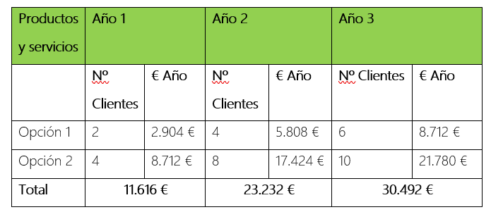

# Anteproxecto fin de ciclo

- [Anteproxecto fin de ciclo](#anteproxecto-fin-de-ciclo)
  - [1- Descrición do proxecto](#1--descrición-do-proxecto)
  - [2- Empresa](#2--empresa)
    - [2.1- Idea de negocio](#21--idea-de-negocio)
    - [2.2- Xustificación da idea](#22--xustificación-da-idea)
    - [2.3- Segmento de clientes](#23--segmento-de-clientes)
    - [2.4- Competencia](#24--competencia)
    - [2.5- Proposta de valor](#25--proposta-de-valor)
    - [2.6- Forma xurídica](#26--forma-xurídica)
    - [2.7- Investimentos](#27--investimentos)
      - [2.7.1- Custos](#271--custos)
      - [2.7.2- Ingresos](#272--ingresos)
    - [2.8- Viabilidade](#28--viabilidade)
      - [2.8.1- Viabilidade técnica](#281--viabilidade-técnica)
      - [2.8.2 - Viabilidade económica](#282---viabilidade-económica)
      - [2.8.3- Conclusión](#283--conclusión)
  - [3- Requirimentos técnicos](#3--requirimentos-técnicos)
  - [4- Planificación](#4--planificación)

## 1- Descrición do proxecto

La aplicación está destinada a la gestión de mantenimientos de equipos, dirigida principalmente a empresas especializadas en este ámbito. El propósito principal de la aplicación es proporcionar una plataforma centralizada que simplifique la gestión de clientes, dispositivos y mantenimientos.

Con esta aplicación, las empresas podrán registrar nuevos clientes y asociar dispositivos a cada uno de ellos, lo que facilitará la creación de un historial detallado de los mantenimientos realizados en cada equipo. Además, la plataforma permitirá asignar técnicos a las solicitudes de servicio y llevar un seguimiento exhaustivo de las intervenciones realizadas.

El objetivo principal de esta aplicación es optimizar y agilizar el proceso de gestión de mantenimientos, permitiendo a las empresas ofrecer un servicio más eficiente y de mayor calidad a sus clientes. Además, se considera que esta solución tiene potencial para convertirse en una herramienta comercializable ya que muchas empresas requieren de herramientas eficientes para gestionar sus operaciones de mantenimiento.

## 2- Empresa

### 2.1- Idea de negocio

El producto central de este proyecto es una aplicación de gestión de mantenimientos de equipos. La propuesta de valor se basa en proporcionar a las empresas una plataforma centralizada y eficiente para gestionar clientes, dispositivos y mantenimientos.

Algunos de los principales valores añadidos radican en ofrecer soporte técnico prioritario, actualizaciones periódicas con nuevas funcionalidades, personalización de la interfaz, integración con otros sistemas empresariales, y recursos educativos como tutoriales y webinars para maximizar el uso de la plataforma.

La utilidad de esta aplicación es facilitar la administración de los procesos de mantenimiento y reparación de equipos, proporcionando comodidad y flexibilidad a las empresas. Esta permite llevar un registro detallado de los clientes, los dispositivos asociados a cada uno y los mantenimientos realizados en cada equipo. Esto ayuda a mejorar la organización interna, optimizar la asignación de recursos y ofrecer un servicio más eficiente y de mayor calidad a sus clientes.

Además del producto central, se podrían ofrecer productos aumentados, como servicios de análisis de datos para identificar tendencias en los mantenimientos realizados, herramientas de programación de intervenciones automatizadas o servicios de asesoramiento técnico para la optimización de procesos de mantenimiento. Estos productos aumentados podrían ofrecer un valor adicional y ampliar las posibilidades de negocio para las empresas que utilicen la aplicación.

### 2.2- Xustificación da idea

La idea de desarrollar una aplicación para la gestión de mantenimientos de equipos surge de la necesidad identificada en muchas empresas de servicios de mantenimiento y reparación de dispositivos de contar con una herramienta eficiente para organizar y gestionar sus actividades. Esta necesidad se deriva de la complejidad inherente a la gestión de múltiples clientes, dispositivos y tareas de mantenimiento, así como de la falta de soluciones integrales disponibles en el mercado que satisfagan estas necesidades de manera adecuada.

Actualmente, en el mercado no he encontrado soluciones específicas para la gestión de mantenimientos de equipos dirigidas al sector de servicios de mantenimiento y reparación de dispositivos. Aunque existen algunas empresas que ofrecen productos relacionados con la gestión de servicios externos o de activos(los cuales están en el apartado de "Competencia"), ninguno de ellos se ajusta a las soluciones o funcionalidades que mi idea proporciona. Esta falta de competidores directos resalta la ausencia de soluciones completas y adaptadas a las necesidades específicas de este sector, lo que subraya aún más la oportunidad que representa desarrollar una herramienta integral y eficiente como la propuesta por este proyecto. Con más de 20.000 empresas dedicadas al mantenimiento y reparación de equipos en el país, existe un claro espacio en el mercado para una solución que cubra todas las necesidades de gestión de mantenimientos de manera adecuada y eficaz.

Por lo tanto, se puede decir que se trata de un segmento de mercado desabastecido o insuficientemente atendido, donde hay una clara oportunidad para desarrollar una solución integral y eficiente que cubra todas las necesidades de gestión de mantenimientos de equipos.

#### Análisis DAFO

##### Debilidades:
- Dependencia de la disponibilidad y confiabilidad de la infraestructura tecnológica.
- Posibles dificultades en la interoperabilidad con sistemas de terceros.
- Posibles problemas de rendimiento o escalabilidad que pueden surgir al manejar grandes volúmenes de datos.

##### Amenazas:
- Rápida evolución tecnológica que puede hacer obsoleta la aplicación en poco tiempo.
- Posibles problemas de seguridad y privacidad de los datos de los clientes.
- Posibilidad de cambios en la regulación que afecten al mercado o a las operaciones del negocio.

##### Fortalezas:
- Solución integral que cubre todas las necesidades de gestión de mantenimientos de equipos.
- Potencial para capturar un segmento de mercado desatendido o insuficientemente atendido.
- Flexibilidad para adaptarse a las necesidades específicas de cada cliente.
- Posibilidad de ofrecer servicios de valor añadido, como soporte técnico o consultoría.

##### Oportunidades:
- Segmento de mercado desatendido o insuficientemente atendido.
- Posibilidad de expandir el negocio a otros sectores o mercados relacionados con la gestión de activos.
- Potencial para establecer alianzas estratégicas con fabricantes de equipos o empresas de servicios complementarios.

### 2.3- Segmento de clientes

#### Mercado Objetivo:
- El negocio estará dirigido a empresas dedicadas al mantenimiento y reparación de equipos, como empresas de servicios de informática, empresas de reparación de electrodomésticos, empresas de mantenimiento industrial, entre otras.
- También se puede considerar como potenciales clientes a departamentos de mantenimiento de grandes empresas o instituciones que gestionan sus propios equipos internamente.

#### Necesidades no Cubiertas:
- A pesar de la disponibilidad de algunas soluciones en el mercado, existe una falta de herramientas integradas para la programación de mantenimientos, lo que conlleva a la dificultad para llevar un seguimiento detallado de las intervenciones realizadas.

#### Análisis de Competidores:
- Al realizar un análisis de la competencia, se ha observado que algunas soluciones existentes en el mercado carecen de funcionalidades clave que son importantes para las empresas de mantenimiento. Por ejemplo, muchas de ellas ofrecen herramientas básicas de programación, pero carecen de capacidades avanzadas de gestión de dispositivos y mantenimientos.

#### Perfil del Cliente Ideal:
- El cliente ideal para nuestra aplicación de gestión de mantenimientos de equipos es una empresa de tamaño mediano a grande que opera en sectores como la informática, la industria manufacturera o el sector de servicios. Este cliente valora la eficiencia y la fiabilidad en la gestión de sus activos y busca una solución integral que le permita optimizar sus procesos de mantenimiento y reparación.

#### Estrategias de Penetración de Mercado:
- Para llegar a nuestro mercado objetivo, planeamos implementar una estrategia de marketing digital que incluya la creación de contenido relevante para nuestro público objetivo, la participación en eventos sectoriales y la colaboración con asociaciones empresariales. Además, estamos explorando la posibilidad de establecer alianzas estratégicas con fabricantes de equipos y empresas de servicios complementarios para ampliar nuestra base de clientes.

#### Características del Segmento:
- Las empresas del segmento suelen tener una amplia variedad de equipos y dispositivos que requieren mantenimiento regular.
- Buscan soluciones integrales que les permitan gestionar eficientemente los mantenimientos, programar intervenciones, asignar técnicos y llevar un seguimiento detallado de las actividades realizadas.

#### Cuantificación del Mercado:
- Según datos del Instituto Nacional de Estadística (INE), en nuestro país existen aproximadamente 26.000 (https://www.ine.es/jaxiT3/Datos.htm?t=3954) empresas dedicadas al mantenimiento y reparación de equipos.

#### Usuarios vs Clientes:
- Los usuarios finales de la aplicación serán los técnicos de mantenimiento y los responsables de operaciones en las empresas clientes.
- Los clientes serán las empresas que contraten el servicio de gestión de mantenimientos, las cuales pagarán por el uso de la plataforma según el número de usuarios y las funcionalidades contratadas.

### 2.4- Competencia

1. **Empresas Competidoras:**
   - Nomadia Field Service: Ofrece un paquete de software para la gestión de servicios externos, con características como programación en tiempo real, reserva de citas y transacciones. [Sitio web](https://www.nomadia-group.com/en/landing-page-nomadia-fsm/?utm_source=GetApp)
   - MEX Maintenance: Proporciona soluciones para la gestión de activos y mantenimiento diario, incluyendo creación de informes y pedidos automáticos de tiendas. Su aplicación MEX Mobile facilita la gestión de instalaciones tanto para los administradores como para los técnicos de servicio en el campo. [Sitio web](https://www.mex.com.au/Products/MEX)
   - MaintainX: Ofrece un software de digitalización de procedimientos y órdenes de trabajo con prioridad para dispositivos móviles. Está diseñado para ayudar a los equipos de primera línea de fábricas a saber exactamente qué necesitan hacer y cómo hacerlo, incluyendo procedimientos de seguridad centralizados. [Sitio web](https://www.getmaintainx.com/?utm_campaign=Maintenance+Management&utm_medium=cpc&utm_source=GetApp)

2. **Análisis de Vacíos en el Mercado:**
   - Aunque existen algunas empresas que ofrecen soluciones relacionadas, no hay competidores directos en España que ofrezcan una aplicación para la gestión de mantenimientos de equipos con las mismas características y funcionalidades que nuestra idea.
   - Esta falta de competidores directos representa una oportunidad para llenar un vacío en el mercado local y ofrecer una solución única y adaptada a las necesidades de las empresas españolas.

3. **Identificación de Desafíos Potenciales:**
   - Uno de los desafíos potenciales podría ser la necesidad de educar al mercado sobre la importancia y los beneficios de utilizar una aplicación específica para la gestión de mantenimientos de equipos.
   - Otro desafío podría ser establecer la confianza y credibilidad entre los potenciales clientes, especialmente si están acostumbrados a utilizar métodos tradicionales de gestión de mantenimientos.
   - Sin embargo, con una estrategia de marketing sólida y un enfoque en la excelencia del producto y el servicio al cliente, estos desafíos pueden superarse con éxito.

### 2.5- Proposta de valor

1. **Diferenciación frente a los competidores:**
   - Nuestro servicio se distingue por ofrecer un enfoque integral en el mantenimiento de equipos, combinando la eficiencia operativa con la atención personalizada al cliente.
   - Implementaremos un sistema de seguimiento detallado de cada mantenimiento realizado, brindando transparencia y confianza a nuestros clientes en cada etapa del proceso.

2. **Mejoras frente a los competidores:**
   - Integraremos tecnología avanzada para agilizar la gestión de mantenimientos y optimizar los tiempos de respuesta, ofreciendo un servicio más rápido y eficiente.
   - Ofreceremos opciones de personalización en los planes de mantenimiento, adaptándonos a las necesidades específicas de cada cliente y superando las soluciones genéricas de la competencia.

3. **Valor que aporta al mercado:**
   - Nuestro servicio proporciona tranquilidad a los clientes al ofrecer un seguimiento detallado y transparente de cada mantenimiento, garantizando la calidad y confiabilidad en la atención.
   - La combinación de eficiencia operativa y atención personalizada mejora la experiencia del cliente, generando una mayor satisfacción y fidelización en el mercado.

4. **¿Por qué comprarán/contratarán este producto/servicio/idea frente al resto?:**
   - Los clientes optarán por nuestro servicio debido a nuestra capacidad para ofrecer soluciones a medida que se adaptan a sus necesidades específicas, brindando un servicio personalizado y eficiente que se distingue de la competencia.
   - La transparencia en la gestión y el seguimiento detallado de cada mantenimiento generarán confianza en los clientes, convirtiéndonos en la opción preferida en el mercado de reparación y mantenimiento de equipos.

### 2.6- Forma xurídica

La opción elegida es constituirme como autónomo, ya que me brinda flexibilidad e independencia económica. Puedo gestionar mi horario, elegir los proyectos y clientes que deseo, y desarrollar nuevas habilidades. Además, tengo el control de mi negocio y puedo crecer profesionalmente. Teniendo en cuenta que ser autónomo implica asumir riesgos económicos y responsabilidades adicionales.

#### Cuota de Autónomos

La cuota de autónomos es un pago mensual obligatorio que debe realizar cada trabajador por cuenta propia a la Seguridad Social. En España, la cuota mínima para los autónomos está determinada por la base de cotización, que es el salario mensual sobre el cual se calculan las cotizaciones sociales. A partir de 2023, la cuota mínima para la base mínima de cotización ronda los 294 euros mensuales, aunque esto puede variar en función de las reformas y actualizaciones anuales.

Existen reducciones y bonificaciones para nuevos autónomos, como la tarifa plana de 80 euros mensuales durante los primeros 12 meses. Esta tarifa puede ampliarse a 24 meses en total con bonificaciones decrecientes durante el segundo año.

#### Requisitos para Constituirse como Autónomo

Para constituirme como autónomo, debo cumplir con los siguientes requisitos y realizar los trámites necesarios:

1. **Registro en la Seguridad Social**: Darme de alta en el Régimen Especial de Trabajadores Autónomos (RETA). 
2. **Alta en Hacienda**: Darme de alta en Hacienda a través del modelo 036 o 037 para obtener el número de identificación fiscal y comunicar el inicio de la actividad económica.
3. **Licencias y Permisos**: Obtener cualquier licencia o permiso necesario para el desarrollo de mi actividad, dependiendo del sector específico.
4. **Libro de Visitas**: Mantener un libro de visitas disponible para posibles inspecciones de trabajo, aunque su obligatoriedad ha sido eliminada en algunas comunidades autónomas.

#### Carga Impositiva

Como autónomo, estaré sujeto a varias obligaciones fiscales:

1. **Impuesto sobre la Renta de las Personas Físicas (IRPF)**: Deberé declarar y pagar trimestralmente el IRPF mediante pagos fraccionados (modelo 130). También, presentaré la declaración anual de la renta.
2. **Impuesto sobre el Valor Añadido (IVA)**: Deberé presentar trimestralmente las liquidaciones del IVA (modelo 303) y una declaración resumen anual (modelo 390). Esto implica cobrar el IVA a mis clientes y pagarlo a Hacienda, descontando el IVA soportado en mis compras y gastos relacionados con la actividad.
3. **Retenciones**: Si contrato a empleados o subcontrato servicios a otros profesionales, debo practicar retenciones en sus facturas y declararlas a través del modelo 111 trimestralmente.

### 2.7- Investimentos

Los recursos materiales y humanos necesarios para poner en marcha el proyecto, así como las necesidades de financiación asociadas son los siguientes:

#### Inversiones:

- **Ordenador Portátil:** El coste es de 669 €.
- **Dominio web:** El coste fijo anual del dominio web será de 10 €/año.
- **Servidor:** El coste fijo mensual del servidor será de 10 €/mes, lo que equivale a 120 €/año.
- **Suministros:** El coste fijo mensual de los suministros será de 56.67€/mes, lo que equivale a 680.04 €/año.

#### 2.7.1- Custos:

- **Salario bruto anual:** El sueldo bruto anual será de 14.400 €.
- **Cuota a la Seguridad Social:** La cuota a la Seguridad Social será de 1029,61 €.
- **Cuota de IRPF:** La cuota del IRPF será de 120,67 €.
- **Tipo de retención en el IRPF:** El tipo de retención en el IRPF será del 0,84%.
- **Salario neto anual:** El sueldo neto anual será de 	13.249,72 €.
- **Cuota IVA:** El porcentaje de IVA aplicado a los productos/servicios será del 21%.
- **Asesorías:** El coste fijo será de 300 €/mes.
- **Marketing y Publicidad:** El coste fijo será de 500 €/mes.

- **Desarrollos web:** Los costes variables de los desarrollos web serán de 5 €/hora, con un máximo de 15 horas al mes, lo que supone un total de 900 € anuales.
- **Soporte técnico:** Los costes variables del soporte técnico serán de 10 €/hora, con un máximo de 15 horas al mes, lo que equivale a 1.670,4 € anuales.

La previsión de costes totales el primer año es de 29.169,72 € anual, siendo esta variable, ya que se debe tener en cuenta que el coste de la inversión inical en el equipo de trabajo.

La previsión de costes totales es de 28.500,72 € anuales, siendo esta variable, ya que se debe tener en cuenta que el coste del uso del servidor varía según el tráfico de la aplicación.

#### 2.7.2- Ingresos

##### Política de precios:
A aplicación será de suscripción mensual:

- **Productos/Servicios:** Se ofrecerán dos opciones de productos/servicios:
  - Opción 1, que incluye la aplicación y soporte de errores por 121 €/mes (precio sin IVA 100 €/mes).
  - Opción 2, que incluye la Opción 1 más la administración y gestión de la app web por 181,5 €/mes (precio sin IVA 150 €/mes).

##### Previsión de ingresos:

- **Año 1:**
  - Opción 1: Con 2 clientes, se generarán ingresos de 2.904 €/año.
  - Opción 2: Con 4 clientes, se generarán ingresos de 8.172 €/año.
  
- **Año 2:**
  - Opción 1: Con 4 clientes, se generarán ingresos de 5.808 €/año.
  - Opción 2: Con 8 clientes, se generarán ingresos de 17.424 €/año.

- **Año 3:**
  - Opción 1: Con 6 clientes, se generarán ingresos de 8.712 €/año.
  - Opción 2: Con 8 clientes, se generarán ingresos de 21.780 €/año.

Con estos datos, se pretende asegurar una gestión eficiente de los recursos y una planificación financiera sólida para la puesta en marcha y desarrollo exitoso del proyecto.

### 2.8- Viabilidade

#### Necesidades detectadas

1. **Ineficiencias en la gestión actual:**
   - Dependencia de sistemas obsoletos basados en papel.
   - Falta de integración entre los procesos de mantenimiento y reparación.
   - Dificultades en la coordinación de técnicos y programación de intervenciones.

2. **Deficiencias en la atención al cliente:**
   - Retrasos en la respuesta a solicitudes de servicio.
   - Falta de seguimiento detallado de las intervenciones realizadas.
   - Escasa capacidad para generar informes de rendimiento y calidad de servicio.

3. **Necesidad de optimización operativa:**
   - Dificultades en la planificación y programación de mantenimientos.
   - Falta de visibilidad sobre el estado de los equipos y su historial de mantenimiento.
   - Limitaciones en la capacidad de gestionar clientes y dispositivos de manera centralizada.
 
#### Posibilidades de Comercialización

1. **Venta Directa a Empresas de Mantenimiento:**
   - **Viabilidad:** Vender directamente a empresas de mantenimiento es una estrategia viable, ya que estas empresas tienen una clara necesidad de gestionar eficientemente sus actividades de mantenimiento.

2. **Suscripciones para Acceso Online:**
   - **Viabilidad:** Ofrecer suscripciones para acceder al sistema online puede ser rentable, especialmente al proporcionar actualizaciones regulares y soporte técnico continuo.
   - **Modelo de Pago:** Las suscripciones pueden estructurarse en planes mensuales, anuales o a largo plazo, brindando flexibilidad a los clientes para elegir la opción que mejor se adapte a sus necesidades y presupuesto.

3. **Alianzas Estratégicas con Proveedores de Equipos:**
   - **Viabilidad:** Establecer alianzas con proveedores de equipos puede ser una estrategia efectiva para llegar a un público objetivo más amplio y generar reconocimiento de marca.
   - **Beneficios Mutuos:** Estas alianzas pueden beneficiar tanto a nuestra empresa como a los proveedores de equipos, ya que nuestra solución de gestión de mantenimiento puede agregar valor a sus clientes y fortalecer la relación comercial.

4. **Servicios de Consultoría y Personalización:**
   - **Viabilidad:** Ofrecer servicios de consultoría y personalización puede ser una fuente adicional de ingresos, especialmente para empresas que requieren soluciones altamente personalizadas.
   - **Valor Agregado:** Estos servicios pueden agregar valor al producto central al adaptarlo a las necesidades específicas de cada cliente, lo que puede aumentar la satisfacción del cliente y la retención a largo plazo.
  
#### Posibles Modelos de Pago para el Negocio

1. **Licenciamiento de software:**
   - Venta de licencias de uso del sistema, con opciones de suscripción mensual o anual.
   - Diferenciación de planes según el número de usuarios y la capacidad de almacenamiento.

2. **Servicios de soporte técnico:**
   - Oferta de paquetes de soporte técnico, que incluyan asistencia telefónica, actualizaciones y mantenimiento.
   - Tarifas diferenciadas según el nivel de servicio y la disponibilidad de atención.

3. **Modelos basados en el uso:**
   - Tarificación por uso del sistema, con precios escalonados según el volumen de operaciones o la cantidad de dispositivos gestionados.
   - Posibilidad de ofrecer versiones gratuitas o de prueba limitada para captar nuevos clientes.

4. **Personalización y consultoría:**
   - Tarifas adicionales por servicios de personalización y consultoría, como la integración con sistemas existentes o el desarrollo de funcionalidades específicas.
   - Oferta de servicios de formación y capacitación para usuarios finales y administradores del sistema.

#### 2.8.1- Viabilidade técnica

Se considera que el proyecto es técnicamente viable debido a las siguientes razones:

1. **Propiedad de Recursos Materiales**: Todos los recursos materiales necesarios para poner en marcha el proyecto son de mi propiedad, lo que incluye equipos, software necesario y cualquier otro hardware o infraestructura requerida.

2. **RRHH**: Al ser el único trabajador del proyecto, tengo un control total sobre el proceso de desarrollo y mantenimiento del sistema, tengo la libertad de elegir las tecnologías más adecuadas para el proyecto según mis preferencias. Esto me permite una adaptación eficiente a las necesidades del negocio y la implementación de soluciones técnicas óptimas, lo que me facilita la toma de decisiones técnicas y la implementación de cambios según sea necesario.

#### 2.8.2 - Viabilidade económica

Teniendo en cuenta los datos sobre la inversión y costes tratados en el apartados de "[2.7- Investimentos](#27--investimentos)", esta sería la evaluación de costes directos e indirectos del proyecto como los beneficios esperados a 2 años vista.

Generando así el siguiente entorno económico:

##### Financiación:

La financiación para la puesta en marcha de la empresa provendrá de fondos propios y recursos familiares. Los principales fondos serán aportados a través de dos fuentes principales:

1. **Terrenos Familiares**: Mi familia posee varios terrenos que serán utilizados como garantía para obtener fondos adicionales si es necesario. Estos terrenos representan un activo significativo que puede ser liquidado o utilizado como colateral para asegurar préstamos o líneas de crédito. La valorización de estos terrenos proporciona una base financiera sólida y confiable.

2. **Aportaciones Directas**: Además de los terrenos, mi familia proporcionará una cantidad sustancial de dinero en efectivo. Este capital será suficiente para cubrir todos los gastos iniciales y operativos previstos en el plan de negocios, incluyendo la adquisición de equipos, desarrollo de software, marketing y otros costos operativos. La disponibilidad de estos fondos asegura que no habrá necesidad inmediata de buscar financiación externa.

##### Plan de Utilización de Fondos

- **Desarrollo de la Aplicación**: Parte de los fondos se destinará al desarrollo y mejora continua de la aplicación de gestión de mantenimientos de equipos. Esto incluye costos de compra de software y licencias, y otros gastos relacionados con la tecnología.
  
- **Infraestructura y Equipamiento**: Los fondos también cubrirán la compra de equipos y mobiliario necesarios para las operaciones diarias de la empresa, como ordenadores, servidores, y otros dispositivos tecnológicos.

- **Marketing y Publicidad**: Se asignará una parte del presupuesto para estrategias de marketing y publicidad con el fin de promocionar la aplicación y atraer a los clientes objetivo.

- **Operaciones y Administración**: Finalmente, los fondos se utilizarán para cubrir los costos operativos y administrativos, incluyendo salarios del personal, alquiler de oficinas si fuera necesario, y otros gastos generales.

##### Seguridad Financiera

La combinación de terrenos familiares y aportaciones directas de la familia proporciona una seguridad financiera sólida para el proyecto. Estos recursos no solo cubren los costos iniciales de puesta en marcha sino que también garantizan una base financiera estable para futuras expansiones y mejoras de la aplicación. Esta estructura financiera minimiza los riesgos asociados con la falta de liquidez y proporciona una base confiable para el crecimiento sostenido del negocio.

#### 2.8.3- Conclusión

1. **¿Es viable?**
   Sí, el proyecto es viable, esto sugiere que el proyecto tiene el potencial de generar beneficios a largo plazo.

2. **¿Los beneficios del proyecto son superiores a los costes?**
   Sí, según la evaluación de costes e ingresos adjunta en la documentación del proyecto, los ingresos son superiores a los costes a partir del tercer año. Esto indica que el proyecto tiene una estructura financiera sólida y tiene el potencial de generar ganancias una vez que se establezca y comience a operar.

3. **¿Las pérdidas pueden cubrirse vía financiamiento?**
   Como se puede observar en el apartado anterior, la estrategia de financiación asegura que la empresa tendrá los recursos necesarios para iniciar sus operaciones sin recurrir a deudas significativas desde el principio. La solidez de los activos familiares y el apoyo financiero directo proporcionan una ventaja competitiva, permitiendo enfocarse en el desarrollo y crecimiento del negocio sin las preocupaciones inmediatas de financiamiento externo.

## 3- Requirimentos técnicos

### Infraestructura:
- **Dominio Web**: Se adquirirá un nombre de dominio adecuado para el proyecto.
- **Servidor Web Dedicado**: Se utilizará un servidor web dedicado para alojar la aplicación.
- **Servidor de Base de Datos**: Se implementará un servidor de base de datos para gestionar los datos del proyecto.
- **Almacenamiento**: Se requerirá almacenamiento suficiente para los archivos y datos de la aplicación.
- **Memoria**: Se asignará memoria adecuada en el servidor para garantizar el rendimiento óptimo.

### Backend:
- **Lenguaje de Programación**: Se utilizará PHP como lenguaje principal en el backend debido a su amplia adopción y funcionalidades para desarrollo web.
- **Framework**: Se empleará Laravel como framework de desarrollo web debido a su estructura modular, su amplio ecosistema de herramientas y su facilidad para implementar patrones de diseño.
- **Base de Datos**: Se utilizará MariaDB como sistema de gestión de base de datos debido a su compatibilidad con MySQL y su rendimiento.
- **Servicio de Autenticación**: Se aprovechará el propio sistema de autenticación de Laravel, que proporciona características de autenticación completas y seguras.

### Frontend:
- **Lenguajes de Programación**: Se empleará HTML, CSS para el desarrollo del frontend para garantizar una experiencia de usuario dinámica y atractiva.
- **Librerías de Estilos**: Se aprovechará Bootstrap para la creación de un diseño responsive y moderno.
- **Gestor de Paquetes**: Se utilizará npm para gestionar las dependencias del proyecto y facilitar la instalación de nuevas herramientas y librerías.

## 4- Planificación

- **Estudio preliminar**
  - Duración estimada: 2 meses
  - Descripción:
    - Definir el alcance y los objetivos del proyecto.
    - Realizar investigación preliminar sobre tecnologías y herramientas a utilizar.
    - Identificar requisitos iniciales y stakeholders.

- **Fase 2: Análisis**
  - Duración estimada: 1 mes
  - Descripción:
    - Recopilar y analizar los requisitos detallados del proyecto.
    - Identificar los casos de uso y escenarios de usuario.
    - Realizar diagramas de flujo y modelos de datos preliminares.

- **Fase 3: Diseño**
  - Duración estimada: 1 mes
  - Descripción:
    - Diseñar la arquitectura del sistema.
    - Crear diagramas de clases y de secuencia.
    - Diseñar la interfaz de usuario (UI) y la experiencia del usuario (UX).

- **Fase 4: Codificación y pruebas**
  - Duración estimada: 4 meses
  - Descripción:
    - Implementar el código según el diseño previo.
    - Realizar pruebas unitarias y de integración.
    - Depurar y corregir errores.
    - Realizar pruebas de aceptación del cliente.

- **Fase 5: Implantación**
  - Duración estimada: 1 mes
  - Descripción:
    - Preparar el entorno de producción.
    - Desplegar la aplicación en el servidor.
    - Realizar pruebas finales en el entorno de producción.
    - Capacitar al cliente en el uso de la aplicación.
   
| Tarea                  | Duración Estimada | Inicio      | Fin         |
|------------------------|-------------------|-------------|-------------|
| Estudio preliminar     | 2 meses           | 01/04/2024  | 01/06/2024  |
| Análisis               | 1 mes             | 01/06/2024  | 01/07/2024  |
| Diseño                 | 1 mes             | 01/07/2024  | 01/08/2024  |
| Codificación y pruebas | 4 meses           | 01/08/2024  | 01/12/2024  |
| Implantación           | 1 mes             | 01/12/2024  | 01/01/2025  |
