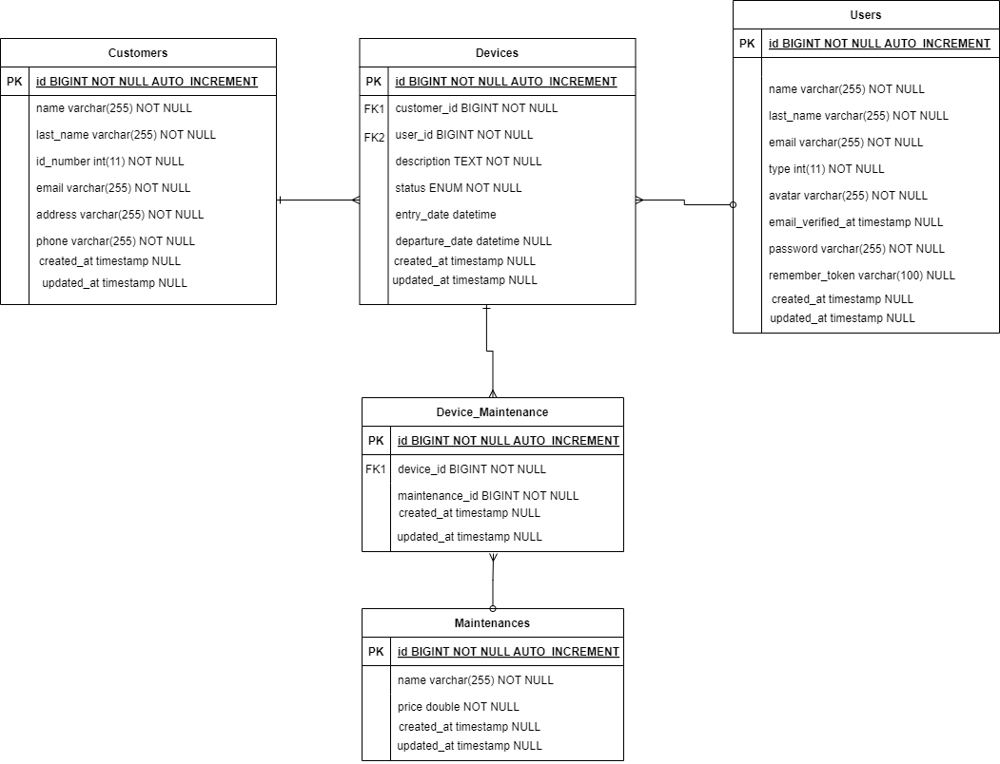
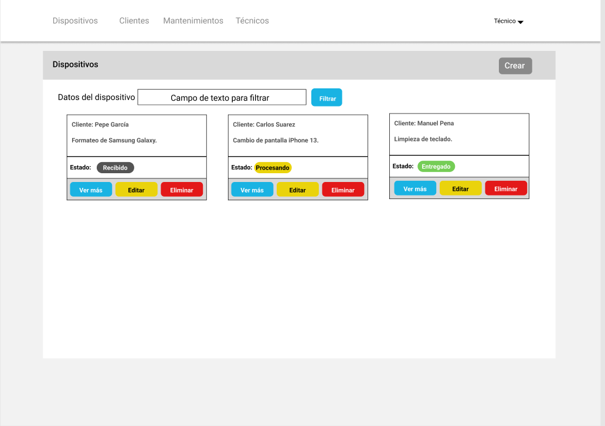
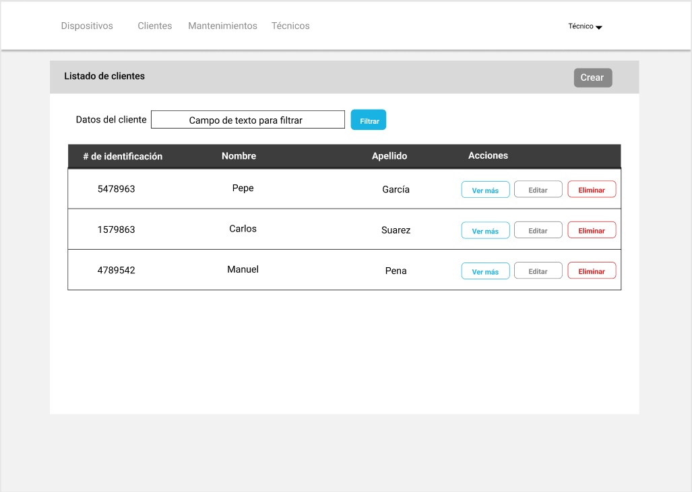
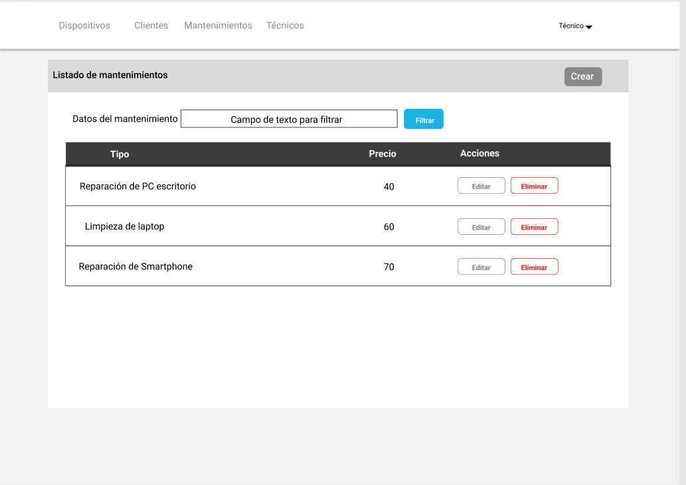
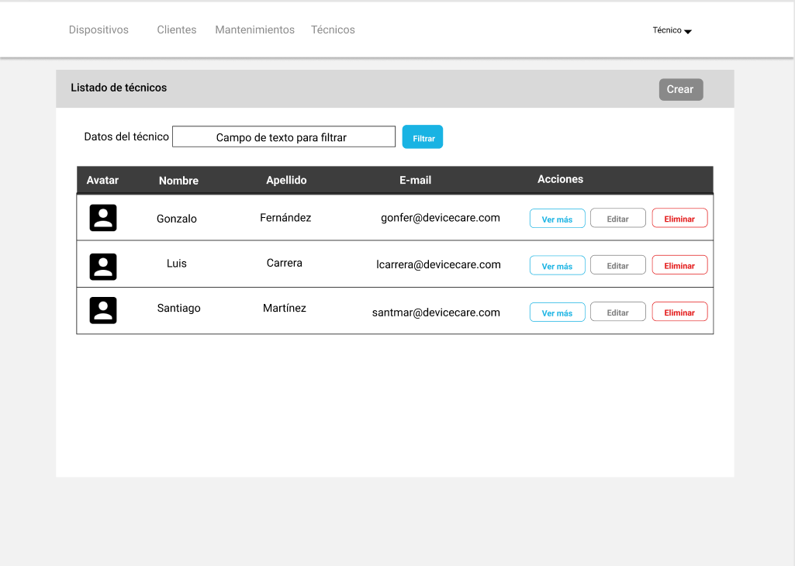

# FASE DE DESEÑO

- [FASE DE DESEÑO](#fase-de-deseño)
  - [1- Diagrama da arquitectura](#1--diagrama-da-arquitectura)
  - [2- Casos de uso](#2--casos-de-uso)
  - [3- Diagrama de Base de Datos](#3--diagrama-de-base-de-datos)
  - [4- Deseño de interface de usuarios](#4--deseño-de-interface-de-usuarios)

> *EXPLICACIÓN:* Este documento inclúe os diferentes diagramas, esquemas e deseños que axuden a describir mellor o [DeviceCare] detallando os seus compoñentes, funcionalidades, bases de datos e interface.

## 1- Diagrama da arquitectura

> Primera versión del Diagrama de Arquitectura

## 2- Casos de uso

> Primera versión de los Diagramas de Casos de Uso

.drawio.png "Diagrama de Caso de Uso del Usuario(Técnico)")

.drawio.png "Diagrama de Caso de Uso del Administrador")

## 3- Diagrama de Base de Datos

> Primera versión del Diagrama de Entidad Relacion / Relacional

## 4- Deseño de interface de usuarios

> Primera versión pantalla de dispositivos

> Primera versión pantalla de clientes

> Primera versión pantalla de mantenimientos

> Primera versión pantalla de técnicos

