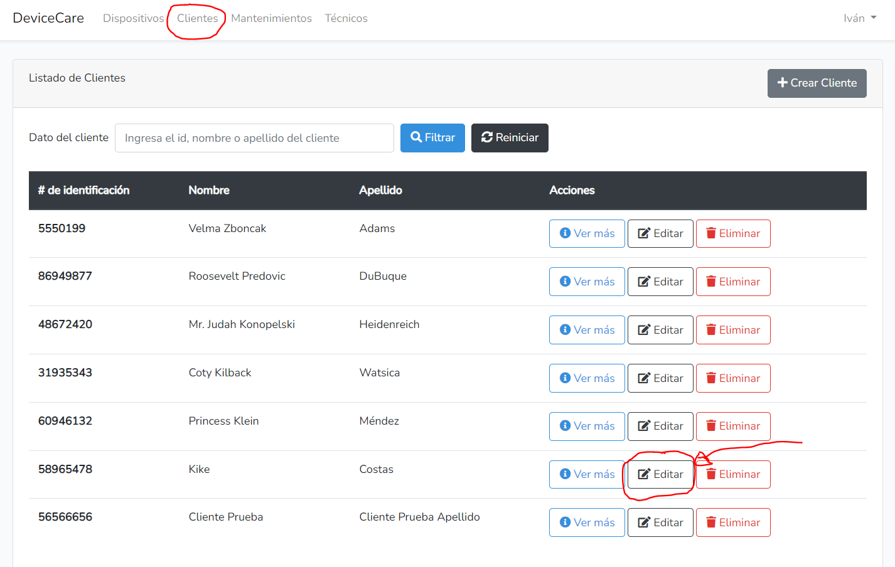
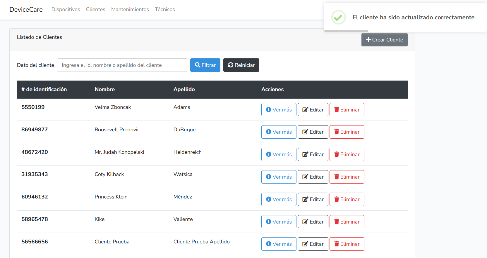

# FASE DE IMPLANTACIÓN

- [FASE DE IMPLANTACIÓN](#fase-de-implantación)
  - [1- Manual técnico](#1--manual-técnico)
    - [1.1- Instalación](#11--instalación)
    - [1.2- Administración do sistema](#12--administración-do-sistema)
  - [2- Manual de usuario](#2--manual-de-usuario)
  - [3- Melloras futuras](#3--melloras-futuras)

## 1- Manual técnico

### 1.1- Instalación

#### 1.1.1-**Requisitos**
- Disponer de Docker y Docker Compose instalado en el equipo.

#### 1.1.2-**Arranque de aplicación**
- Ejecutar el comando `docker compose up -d`

#### 1.1.2-**Carga inicial en la base de datos**
- Ejecutar los siguientes comandos:
  `docker compose exec app php artisan migrate`
  `docker compose exec app php artisan db:seed`

#### 1.1.2-**Usuario admin**
- Nombre de usuario: **admin@devicecare.com**.
- Contraseña de usuario: **secret123**.

### 1.2- Administración do sistema

Una vez que la aplicación esté en funcionamiento, es crucial realizar tareas regulares de administración del sistema para asegurar su correcto funcionamiento y la integridad de los datos. A continuación, se detallan las principales tareas de administración que deben llevarse a cabo:

#### 1.3.1- Copias de seguridad del sistema

Para garantizar la recuperación de datos en caso de fallos, es necesario realizar copias de seguridad periódicas tanto del sistema como de la base de datos.

- **Frecuencia:** Diaria
- **Procedimiento:** 
  - Utilizar scripts automatizados para crear copias de seguridad de los contenedores Docker.
  - Guardar las copias de seguridad en un almacenamiento seguro y redundante.

#### 1.3.2- Copias de seguridad de la base de datos

Las copias de seguridad de la base de datos son esenciales para preservar los datos de la aplicación.

- **Frecuencia:** Diaria
- **Procedimiento:** 
  - Ejecutar el siguiente comando para hacer una copia de seguridad de la base de datos:
    ```sh
    docker exec [database_container_name] pg_dump -U [username] [database_name] > backup.sql
    ```
  - Almacenar el archivo `backup.sql` en un lugar seguro.

#### 1.3.3- Gestión de usuarios

La gestión de usuarios incluye la creación, modificación y eliminación de cuentas de usuario.

- **Procedimiento:**
  - Acceder al panel de administración de la aplicación.
  - Utilizar las opciones disponibles para añadir nuevos usuarios, modificar permisos o eliminar usuarios existentes.

#### 1.3.4- Gestión de seguridad

Mantener la seguridad del sistema es fundamental para proteger los datos y la integridad de la aplicación.

- **Procedimiento:**
  - Implementar autenticación de dos factores (2FA) para los usuarios.
  - Realizar auditorías de seguridad periódicas.
  - Mantener el software y las dependencias actualizadas para mitigar vulnerabilidades conocidas.

#### 1.3.5- Gestión de incidencias

Las incidencias pueden ser de dos tipos: de sistema y de software. Es importante gestionarlas de manera eficiente para minimizar el impacto en el servicio.

- **Incidencias de sistema:**
  - **Accesos no autorizados a la base de datos:**
    - Monitorizar los logs de acceso para detectar actividades sospechosas.
    - Configurar alertas automáticas para accesos no autorizados.
  - **Procedimiento:**
    - Investigar cualquier acceso no autorizado y tomar medidas correctivas.
    - Informar a los usuarios afectados y realizar un análisis de las brechas de seguridad.

- **Incidencias de software:**
  - **Fallo en el software:**
    - Monitorizar el rendimiento de la aplicación y los logs de errores.
    - Configurar alertas automáticas para fallos críticos.
  - **Procedimiento:**
    - Diagnosticar y resolver los errores de software lo antes posible.
    - Realizar pruebas exhaustivas antes de aplicar cualquier corrección al sistema en producción.

## 2- Manual de usuario

### 2.1- Formación de usuarios

Para asegurar que los usuarios puedan utilizar la aplicación de manera eficiente, se recomienda llevar a cabo una formación inicial. Esta formación ayudará a los usuarios a familiarizarse con las funcionalidades de la aplicación y a aprovechar al máximo sus capacidades.

##### Planificación de la formación:

- **Duración:** 2 sesiones de 2 horas cada una.
- **Formato:** Online (videollamadas) o presencial, dependiendo de la preferencia de la empresa.
- **Contenido de las sesiones:**
  - **Sesión 1: Introducción y funcionalidades básicas**
    - Presentación general de la aplicación.
    - Registro y gestión de clientes.
    - Registro y gestión de dispositivos.
    - Asignación de técnicos y creación de mantenimientos.
    - Visualización y edición de información.
  - **Sesión 2: Funcionalidades avanzadas y buenas prácticas**
    - Gestión de usuarios y roles.
    - Resolución de problemas comunes.
    - Buenas prácticas para el uso diario de la aplicación.

### 2.2- Manual de usuario

A continuación, se presenta el manual de usuario, diseñado para guiar a los usuarios en el uso de la aplicación:

#### Índice del Manual de Usuario:

1. [Introducción](#introducción)
2. [Registro y Gestión de Clientes](#registro-y-gestión-de-clientes)
3. [Registro y Gestión de Dispositivos](#registro-y-gestión-de-dispositivos)
4. [Asignación de Técnicos y Creación de Mantenimientos](#asignación-de-técnicos-y-creación-de-mantenimientos)
5. [Visualización y Edición de Información](#visualización-y-edición-de-información)
6. [Gestión de Usuarios y Roles](#gestión-de-usuarios-y-roles)
7. [FAQ](#faq)

#### 1. Introducción

Bienvenido al manual de usuario de la aplicación DeviceCare. Esta guía le ayudará a navegar y utilizar todas las funcionalidades disponibles para optimizar sus procesos de mantenimiento.

#### 2. Registro y Gestión de Clientes

Para registrar un nuevo cliente:
1. Inicie sesión en la aplicación.
2. Vaya a la sección "Clientes".
3. Haga clic en "Añadir Cliente".
4. Complete el formulario con la información del cliente y guarde los cambios.

c

Para gestionar clientes existentes:
1. Inicie sesión en la aplicación.
2. Vaya a la sección "Clientes".
3. Seleccione el cliente que desea editar o eliminar.
4. Realice las modificaciones necesarias y guarde los cambios.






#### 3. Registro y Gestión de Dispositivos

Para registrar un nuevo dispositivo:
1. Inicie sesión en la aplicación.
2. Vaya a la sección "Dispositivos".
3. Haga clic en "Añadir Dispositivo".
4. Complete el formulario con la información del dispositivo y guarde los cambios.

Para gestionar dispositivos existentes:
1. Inicie sesión en la aplicación.
2. Vaya a la sección "Dispositivos".
3. Seleccione el dispositivo que desea editar o eliminar.
4. Realice las modificaciones necesarias y guarde los cambios.

#### 4. Asignación de Técnicos y Creación de Mantenimientos

Para asignar un técnico y crear un mantenimiento:
1. Inicie sesión en la aplicación.
2. Vaya a la sección "Mantenimientos".
3. Haga clic en "Añadir Mantenimiento".
4. Complete el formulario con la información del mantenimiento, incluyendo la asignación del técnico, y guarde los cambios.

#### 5. Visualización y Edición de Información

Para visualizar y editar la información:
1. Inicie sesión en la aplicación.
2. Navegue a la sección correspondiente (Clientes, Dispositivos, Mantenimientos).
3. Seleccione el elemento que desea ver o editar.
4. Realice las modificaciones necesarias y guarde los cambios.

#### 6. Gestión de Usuarios y Roles

Para gestionar usuarios y roles:
1. Inicie sesión en la aplicación como administrador.
2. Vaya a la sección "Usuarios".
3. Añada, edite o elimine usuarios y asigne roles según sea necesario.

#### 7. FAQ

**¿Cómo recupero mi contraseña?**
- Vaya a la página de inicio de sesión y haga clic en "Olvidé mi contraseña". Siga las instrucciones para restablecerla.

**¿Cómo añado un nuevo cliente?**
- Vaya a la sección "Clientes" y haga clic en "Añadir Cliente". Complete el formulario y guarde los cambios.

**¿Cómo asigno un mantenimiento a un técnico?**
- Vaya a la sección "Mantenimientos" y haga clic en "Añadir Mantenimiento". Complete el formulario y asigne el técnico correspondiente.

Para cualquier otra pregunta o soporte adicional, por favor contacte al soporte técnico

## 3- Melloras futuras

La aplicación web "DeviceCare" se encuentra en una etapa prematura de su desarrollo, por lo cual aún no dispone de todo el potencial que podría llegar a alcanzar en un futuro con mejoras y posibles ampliaciones.

Algunas de las nuevas funcionalidades que podrían considerarse son las siguientes:

1. **Notificaciones Automatizadas**:
   - Desarrollar un sistema de notificaciones automatizadas para alertar a los clientes sobre el estado de sus equipos y los próximos mantenimientos programados.

2. **Gestión de Inventario**:
   - Agregar funcionalidades para gestionar el inventario de piezas y repuestos, facilitando la gestión de pedidos de suministros y el seguimiento de productos disponibles.

3. **Programación de Mantenimientos Periódicos**:
   - Permitir a los clientes programar mantenimientos periódicos para sus equipos, con recordatorios automáticos para garantizar un servicio preventivo constante.

4. **Integración de Facturación**:
   - Integrar un sistema de facturación para generar automáticamente facturas detalladas de los servicios prestados, simplificando la gestión financiera de la empresa.

5. **Análisis de Datos y Reportes**:
   - Incorporar herramientas de análisis de datos y generación de reportes para visualizar métricas clave y tomar decisiones informadas basadas en datos.

6. **Gestión de Personal y Horarios**:
   - Desarrollar un módulo para gestionar el personal técnico, asignar horarios de trabajo y planificar rutas de servicio de manera eficiente.

7. **Soporte Multilingüe**:
   - Incorporar soporte para múltiples idiomas para adaptar la aplicación a las necesidades de clientes internacionales.

8. **Integración con IoT**:
    - Explorar la integración con dispositivos IoT para monitorear el estado de los equipos de forma remota y anticipar posibles problemas.

Estas son solo algunas ideas de posibles mejoras que podrían considerarse para ampliar y enriquecer la funcionalidad de la aplicación.
