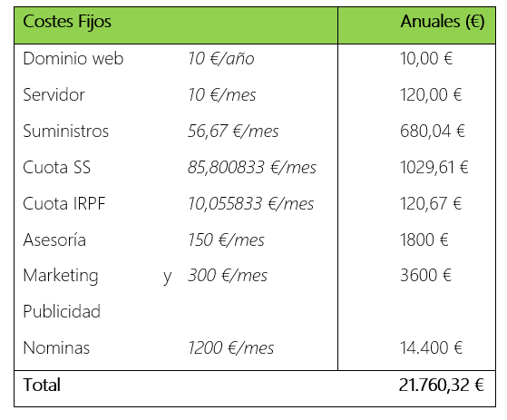
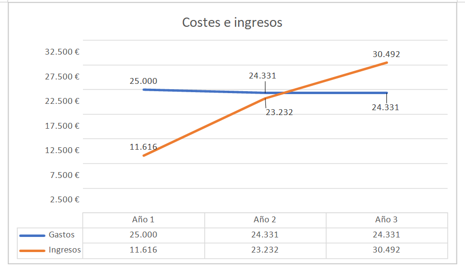

# Anteproxecto fin de ciclo

- [Anteproxecto fin de ciclo](#anteproxecto-fin-de-ciclo)
  - [1- Descrición do proxecto](#1--descrición-do-proxecto)
  - [2- Xustificación do proxecto](#2--xustificación-do-proxecto)
  - [3- Axudas e financiación](#3--axudas-e-financiación)
  - [4- Prevención de riesgos laborales](#4--prevención-de-riesgos-laborales)
  - [5- Modelo de negocio](#5--modelo-de-negocio)
    - [5.1- Viabilidade](#51--viabilidade)
      - [5.1.1- Viabilidade técnica](#511--viabilidade-técnica)
      - [5.1.2- Viabilidade económica](#512--viabilidade-económica)
    - [5.2- Competencia](#52--competencia)
    - [5.3- Promoción](#53--promoción)
  - [6- Requirimentos](#6--requirimentos)
  - [7- Planificación](#7--planificación)

## 1- Descrición do proxecto

“BIOS Simulator” pretende ser un sistema educativo basado en una página web con el estilo de una BIOS, está diseñada para docentes que buscan un sistema de aprendizaje sencillo y dinámico para enseñar como funciona una BIOS.

“BIOS Simulator” permite al docente subir plantillas de ejercicios sobre las diversas funciones de las que dispone una BIOS. El sistema automatiza la corrección de los ejercicios para que los alumnos puedan verificar las respuestas de forma automática.

Además, el diseño de la web ha sido creada para ofrecer un entorno amigable e interactivo tanto para docentes como alumnos.

"BIOS Simulator" ofrece una solución en línea como una aplicación web, lo que facilita su acceso al usuario, quien solo necesita un navegador para conectarse al servidor del proyecto, sin necesidad de instalar software adicional.

Todos los recursos necesarios para la prestación de los servicios se almacenan en el servidor: plantillas de ejercicios, base de datos, copias de seguridad, etc.

El éxito de la aplicación depende de la correcta configuración de los parámetros del sistema. Es decir, plantillas de ejercicios, soluciones de estos mismos, actividades que son asociadas por el profesor que crea la plantilla. Con la combinación correcta de los valores de estas variables, puede asegurarse de que se crea la plantilla correcta de acuerdo con los requisitos establecidos en las soluciones.

## 2- Xustificación do proxecto

Este proyecto surge de la necesidad de los docentes a la hora de mostrar las funcionalidades de la BIOS de manera segura y sin riesgos. “BIOS Simulator” está destinado para trabajar con profesores que impartan esta materia sin la necesidad de tener que agrupar a los alumnos en un solo ordenador. De esta manera disminuyen los posibles problemas que se puedan llegar a causar a los equipos, ya que con este sistema cada alumno puede aprender a utilizar una BIOS desde su propio ordenador de manera controlada y segura ya que estarán trabajando sobre una aplicación web y no en la propia BIOS.

## 3- Axudas e financiación

Los recursos materiales y humanos necesarios para poner en marcha el proyecto, así como las necesidades de financiación asociadas son los siguientes:

### Recursos materiales:

- **Dominio web:** El coste fijo anual del dominio web será de 10 €/año.
- **Servidor:** El coste fijo mensual del servidor será de 10 €/mes, lo que equivale a 120 €/año.

- **Desarrollos web:** Los costes variables de los desarrollos web serán de 5 €/hora, con un máximo de 15 horas al mes, lo que supone un total de 900 € anuales.
- **Soporte técnico:** Los costes variables del soporte técnico serán de 10 €/hora, con un máximo de 15 horas al mes, lo que equivale a 1800 € anuales.

La previsión de costes totales es de 2.700 € anuales, siendo esta variable ya que se debe tener en cuenta que el coste del uso del servidor varía según el tráfico de la aplicación.

### Recursos humanos:

- **Personal de desarrollo:** Se determinará el número de desarrolladores necesarios para llevar a cabo el proyecto, así como sus roles y responsabilidades específicas.
- **Diseñadores y creativos:** Se considerará la contratación de diseñadores gráficos, diseñadores web y otros profesionales creativos para la creación de la identidad visual y el diseño del sitio web.
- **Gestores de proyecto:** Se asignará personal para la gestión y coordinación del proyecto, incluyendo la planificación, seguimiento y control de las actividades, así como la comunicación con los interesados.

### Financiación:

- **Costes totales anuales:** Los costes totales del proyecto para el año serán de 2700 €.
- **Productos/Servicios:** Se ofrecerán dos opciones de productos/servicios:
  - Opción 1, que incluye la aplicación y soporte de errores por 15 €/mes.
  - Opción 2, que incluye la Opción 1 más la administración y gestión de la app web por 30 €/mes.

### Previsión de ingresos:

- **Año 1:**
  - Opción 1: Con 2 clientes, se generarán ingresos de 360,00 €/año.
  - Opción 2: Con 4 clientes, se generarán ingresos de 1.440,00 €/año.
  
- **Año 2:**
  - Opción 1: Con 2 clientes, se generarán ingresos de 360,00 €/año.
  - Opción 2: Con 8 clientes, se generarán ingresos de 2.880,00 €/año.

Con estos datos, se pretende asegurar una gestión eficiente de los recursos y una planificación financiera sólida para la puesta en marcha y desarrollo exitoso del proyecto de la página web educativa que simula una BIOS.

## 4- Prevención de riesgos laborales

En este apartado se detallan las medidas necesarias para garantizar la seguridad y salud de los trabajadores involucrados en el desarrollo y mantenimiento de Bios-Simulator. Además, se identifican los riesgos inherentes a la ejecución de las actividades y se establece un plan de prevención de riesgos, así como los medios y equipos necesarios para mitigarlos.

### Necesidades de permisos y autorizaciones

Para llevar a cabo las actividades relacionadas con el desarrollo y mantenimiento de la página web educativa, no se requieren permisos especiales o autorizaciones adicionales más allá de las habituales para el desarrollo de software y el alojamiento web.

### Riesgos inherentes a la ejecución

1. **Riesgos ergonómicos:** Dado que el trabajo se realiza frente a un ordenador, existe el riesgo de fatiga visual, dolores musculares y lesiones relacionadas con la postura. Se debe promover el uso de mobiliario ergonómico y realizar pausas regulares para descansar la vista y estirar los músculos.

2. **Riesgos psicosociales:** La presión por cumplir con los plazos de entrega y la concentración prolongada pueden provocar estrés y ansiedad en los trabajadores. Se deben establecer medidas para gestionar la carga de trabajo, fomentar un ambiente laboral positivo y ofrecer apoyo psicológico si es necesario.

3. **Riesgos de seguridad de la información:** Dado que la página web puede contener información sensible o confidencial, existe el riesgo de violaciones de seguridad, como el acceso no autorizado o la divulgación de datos. Se deben implementar medidas de seguridad adecuadas, como el cifrado de datos, el control de acceso y la capacitación en concienciación sobre seguridad.

### Plan de prevención de riesgos

- Se proporcionará formación sobre ergonomía y seguridad en el trabajo a todos los empleados involucrados en el desarrollo y mantenimiento de la página web educativa.
- Se establecerán pausas regulares durante la jornada laboral para descansar la vista y realizar ejercicios de estiramiento.
- Se realizarán evaluaciones periódicas de riesgos psicosociales y se implementarán medidas para promover el bienestar emocional de los trabajadores.
- Se aplicarán políticas de seguridad de la información, que incluyen la gestión de contraseñas, el cifrado de datos y la protección contra malware y ataques cibernéticos.
- Se designará a un responsable de seguridad y salud en el trabajo para supervisar la implementación del plan de prevención de riesgos y coordinar las acciones necesarias.

### Medios y equipos necesarios

- Equipos informáticos adecuados, como ordenadores portátiles o de escritorio con pantallas de alta resolución y teclados ergonómicos.
- Mobiliario de oficina ergonómico, que incluye sillas ajustables y mesas de trabajo con altura regulable.
- Software de seguridad informática, como antivirus, firewall y herramientas de detección de intrusiones.
- Material de formación sobre ergonomía, seguridad en el trabajo y concienciación sobre seguridad de la información.

## 5- Modelo de negocio

La opción elegida es constituirme como autónomo, ya que me brinda flexibilidad y independencia económica. Puedo gestionar mi horario, elegir los proyectos y clientes que deseo, y desarrollar nuevas habilidades. Además, tengo el control de mi negocio y puedo crecer profesionalmente. Teniendo en cuenta que ser autónomo implica asumir riesgos económicos y responsabilidades adicionales.

He detectado posibles necesidades en el actual Sistema Educativo, en el que la educación a distancia está en auge.

### Necesidades detectadas

1. **Herramientas de Enseñanza Efectivas**:
   - Los profesores necesitan herramientas efectivas que les permitan enseñar de manera clara y comprensible las funcionalidades de la BIOS a los estudiantes.

2. **Seguridad y Protección del Equipo**:
   - Es fundamental garantizar que los estudiantes puedan aprender sobre la BIOS sin correr el riesgo de dañar los equipos. Por lo tanto, se necesita una solución que proporcione un entorno seguro y controlado para practicar.

3. **Acceso Remoto**:
   - En entornos educativos donde el aprendizaje a distancia es común, es importante contar con una herramienta que permita a los estudiantes acceder al material de enseñanza desde cualquier lugar.

4. **Flexibilidad y Escalabilidad**:
   - El sistema educativo puede requerir una solución flexible y escalable que pueda adaptarse a diferentes entornos y necesidades educativas, desde pequeñas aulas hasta grandes instituciones.

5. **Actualización de Contenidos**:
   - Es posible que se necesite una forma fácil y eficiente de actualizar y mantener el contenido del curso relacionado con la BIOS a medida que evolucionan las tecnologías y las prácticas de enseñanza.

6. **Feedback y Evaluación**:
   - Los profesores pueden requerir herramientas integradas que les permitan evaluar el progreso de los estudiantes y proporcionar retroalimentación personalizada sobre su desempeño en las actividades relacionadas con la BIOS.

7. **Accesibilidad y Usabilidad**:
   - Es importante que la herramienta sea accesible para todos los estudiantes, incluidos aquellos con discapacidades, y que tenga una interfaz de usuario intuitiva y fácil de usar.
 
### Posibilidades de Comercialización

1. **Venta Directa a Instituciones Educativas**:
   - **Viabilidad**: Vender directamente a instituciones educativas puede ser viable si el sistema ofrece un valor claro y demostrable para mejorar la enseñanza de la BIOS.
   - **Competidores**: Es posible que existan competidores que ofrecen herramientas similares para la enseñanza de la BIOS, como software educativo especializado o simuladores de sistemas informáticos por lo que mi empresa se esforzará en ser la más competitiva.

2. **Suscripciones para Acceso Online**:
   - **Viabilidad**: Ofrecer suscripciones para acceder al sistema online puede ser una opción rentable, especialmente al proporcionar actualizaciones regulares y soporte técnico continuo.

3. **Licencias para Escuelas y Universidades**:
   - **Viabilidad**: Ofrecer licencias de uso a escuelas y universidades puede llegar a ser una estrategia efectiva para llegar a un amplio público objetivo y generar ingresos.

4. **Alianzas con Editoriales Educativas**:
   - **Viabilidad**: Establecer alianzas con editoriales educativas para incluir "BIOS Simulator" como parte de sus materiales de enseñanza puede ser una forma efectiva de llegar a más usuarios y generar reconocimiento de marca.

5. **Programas de Capacitación para Profesores**:
   - **Viabilidad**: Ofrecer programas de capacitación para profesores sobre cómo utilizar eficazmente "BIOS Simulator" en el aula puede ser una forma de generar ingresos adicionales y aumentar la adopción del sistema.
  
### Posibles Modelos de Pago para el Negocio

1. **Pago Único por Licencia**:
   - Los clientes pagan una tarifa única por una licencia de uso del producto. Una vez pagada, tienen acceso completo al sistema sin necesidad de pagos adicionales.

2. **Suscripción Mensual/Anual**:
   - Los clientes pagan una tarifa recurrente, ya sea mensual o anual, para acceder al sistema y recibir actualizaciones periódicas, soporte técnico y nuevas características.

3. **Modelo Freemium**:
   - Ofrece una versión básica gratuita del producto con funcionalidades limitadas, y luego ofrece opciones premium de pago con características adicionales y funcionalidades avanzadas.

4. **Pago por Personalización o Servicios Profesionales**:
   - Ofrece servicios de personalización del sistema según las necesidades específicas del cliente, cobrando una tarifa por estos servicios adicionales.

5. **Pago por Capacitación o Cursos**:
   - Ofrece cursos de capacitación adicionales para usuarios interesados en aprender a utilizar el sistema de manera más efectiva, cobrando una tarifa por la participación en estos cursos.
 
### 5.1- Viabilidade

#### 5.1.1- Viabilidade técnica

Se considera que el proyecto es técnicamente viable debido a las siguientes razones:

1. **Propiedad de Recursos Materiales**: Todos los recursos materiales necesarios para poner en marcha el proyecto son de mi propiedad, lo que incluye equipos, software necesario y cualquier otro hardware o infraestructura requerida.

2. **RRHH**: Al ser el único trabajador del proyecto, tengo un control total sobre el proceso de desarrollo y mantenimiento del sistema, tengo la libertad de elegir las tecnologías más adecuadas para el proyecto según mis preferencias. Esto me permite una adaptación eficiente a las necesidades del negocio y la implementación de soluciones técnicas óptimas, lo que me facilita la toma de decisiones técnicas y la implementación de cambios según sea necesario.

#### 5.1.2- Viabilidade económica

Evaluación de costes directos e indirectos del proyecto como los beneficios esperados a 2 años vista.

  

### 5.2- Competencia

La competencia en el mercado se compone de varias empresas que ofrecen productos o servicios similares al que ofrece mi empresa pero este proyecto tiene además el valor añadido de poder ser destinado al campo de la educación.

### 5.3- Promoción

#### Las Técnicas Elegidas son:

1. **Redes Sociales**:
   - Utilizaremos plataformas como Facebook, Twitter, e Instagram para llegar a una amplia audiencia, compartir contenido relevante y establecer una comunidad en línea.

2. **Plataformas Multimedia**:
   - Aprovecharemos plataformas como YouTube y Vimeo para crear videos promocionales, tutoriales y demostraciones de nuestros productos y servicios.

3. **Página Web**:
   - Desarrollaremos y mantendremos una página web profesional que sirva como punto central de información sobre nuestra empresa, productos y servicios.

4. **Posicionamiento Web**:
   - Implementaremos estrategias de SEO (Optimización de Motores de Búsqueda) para mejorar el posicionamiento de nuestra página web en los resultados de búsqueda y aumentar nuestra visibilidad en línea.

5. **Patrocinios**:
   - Exploraremos oportunidades de patrocinio de eventos locales, conferencias educativas y competiciones estudiantiles para aumentar la exposición de nuestra marca y establecer asociaciones en la comunidad.

6. **Prácticas de Responsabilidad Social Corporativa (RSC)**:
   - Nos comprometeremos con prácticas empresariales socialmente responsables, como donaciones a organizaciones benéficas locales, programas de voluntariado y acciones medioambientales, para fortalecer nuestra imagen de marca y contribuir positivamente a la comunidad.

#### Justificación de la Elección:

- **Alcance Amplio y Diversificado**: Al combinar diferentes técnicas de promoción, podemos llegar a una audiencia más amplia y diversa, abarcando tanto a usuarios activos en línea como a aquellos que prefieren medios tradicionales.

- **Interacción y Engagement**: Las redes sociales y las plataformas multimedia nos permitirán interactuar directamente con nuestros clientes potenciales, responder preguntas, recopilar comentarios y crear relaciones más sólidas con nuestra audiencia.

- **Visibilidad y Credibilidad**: Una página web bien diseñada y un sólido posicionamiento en buscadores aumentarán nuestra visibilidad en línea y mejorarán nuestra credibilidad como empresa.

- **Participación en la Comunidad**: A través de patrocinios, eventos y prácticas de RSC, demostraremos nuestro compromiso con la comunidad local y ganaremos la confianza y lealtad de los clientes al demostrar nuestros valores y responsabilidad social.

## 6- Requirimentos

### Infraestructura:
- **Dominio Web**: Se adquirirá un nombre de dominio adecuado para el proyecto.
- **Servidor Web Dedicado**: Se utilizará un servidor web dedicado para alojar la aplicación.
- **Servidor de Base de Datos**: Se implementará un servidor de base de datos para gestionar los datos del proyecto.
- **Almacenamiento**: Se requerirá almacenamiento suficiente para los archivos y datos de la aplicación.
- **Memoria**: Se asignará memoria adecuada en el servidor para garantizar el rendimiento óptimo.

### Backend:
- **Lenguaje de Programación**: Se utilizará PHP como lenguaje principal en el backend debido a su amplia adopción y funcionalidades para desarrollo web.
- **Framework**: Se empleará Laravel como framework de desarrollo web debido a su estructura modular, su amplio ecosistema de herramientas y su facilidad para implementar patrones de diseño.
- **Base de Datos**: Se utilizará MariaDB como sistema de gestión de base de datos debido a su compatibilidad con MySQL y su rendimiento.
- **Servicio de Autenticación**: Se aprovechará el propio sistema de autenticación de Laravel, que proporciona características de autenticación completas y seguras.

### Frontend:
- **Lenguajes de Programación**: Se empleará HTML, CSS y JavaScript para el desarrollo del frontend para garantizar una experiencia de usuario dinámica y atractiva.
- **Librerías de Estilos**: Se aprovechará Bootstrap para la creación de un diseño responsive y moderno.
- **Gestor de Paquetes**: Se utilizará npm para gestionar las dependencias del proyecto y facilitar la instalación de nuevas herramientas y librerías.

## 7- Planificación

- **Estudio preliminar**
  - Duración estimada: 2 meses
  - Descripción:
    - Definir el alcance y los objetivos del proyecto.
    - Realizar investigación preliminar sobre tecnologías y herramientas a utilizar.
    - Identificar requisitos iniciales y stakeholders.

- **Fase 2: Análisis**
  - Duración estimada: 1 mes
  - Descripción:
    - Recopilar y analizar los requisitos detallados del proyecto.
    - Identificar los casos de uso y escenarios de usuario.
    - Realizar diagramas de flujo y modelos de datos preliminares.

- **Fase 3: Diseño**
  - Duración estimada: 1 mes
  - Descripción:
    - Diseñar la arquitectura del sistema.
    - Crear diagramas de clases y de secuencia.
    - Diseñar la interfaz de usuario (UI) y la experiencia del usuario (UX).

- **Fase 4: Codificación y pruebas**
  - Duración estimada: 4 meses
  - Descripción:
    - Implementar el código según el diseño previo.
    - Realizar pruebas unitarias y de integración.
    - Depurar y corregir errores.
    - Realizar pruebas de aceptación del cliente.

- **Fase 5: Implantación**
  - Duración estimada: 1 mes
  - Descripción:
    - Preparar el entorno de producción.
    - Desplegar la aplicación en el servidor.
    - Realizar pruebas finales en el entorno de producción.
    - Capacitar al cliente en el uso de la aplicación.
   
| Tarea                  | Duración Estimada | Inicio      | Fin         |
|------------------------|-------------------|-------------|-------------|
| Estudio preliminar     | 2 meses           | 01/04/2024  | 01/06/2024  |
| Análisis               | 1 mes             | 01/06/2024  | 01/07/2024  |
| Diseño                 | 1 mes             | 01/07/2024  | 01/08/2024  |
| Codificación y pruebas | 4 meses           | 01/08/2024  | 01/12/2024  |
| Implantación           | 1 mes             | 01/12/2024  | 01/01/2025  |
